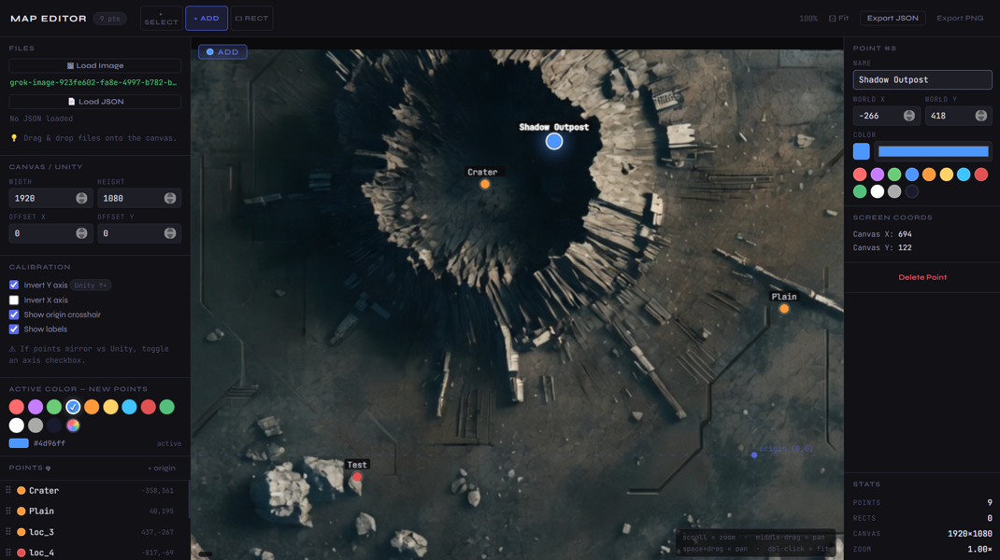

# Map Location Editor

> A browser-based utility for placing, managing, and exporting named location points on campaign maps — built for **[Eryxian](https://www.eryxian.com)** games and useful for any 2D project in Unity or similar platforms.



---

## Motivation

This tool was created as a development utility for **Eryxian** — a universe of campaign-driven games at [www.eryxian.com](https://www.eryxian.com). During development, there was a practical need to visually place, name, and fine-tune hundreds of location points directly on top of in-game map artwork, then export them as structured JSON that Unity could read at runtime.

Most general-purpose map tools are either too heavy, too generic, or export formats that don't map cleanly to Unity's world-space coordinate system. This editor stays focused: load your map image, drop your points, calibrate the coordinate axes to match your Unity scene, and export. That's it.

If you work with 2D maps in Unity, Godot, or any environment where locations are stored as named world-space coordinates, this editor can slot directly into your workflow.

---

## Features

- **Visual point placement** — click to drop named location markers directly on top of your map image
- **Active color palette** — pick a color before placing; every new point uses it. Twelve presets plus a custom color picker
- **Point management** — rename, recolor, and reposition any point via the inspector panel or by dragging it on the canvas
- **Drag-to-reorder list** — drag handles in the sidebar let you change the export order of points without touching coordinates
- **Zoom & pan** — scroll to zoom (centered on cursor), middle-mouse drag or Space+drag to pan, double-click to fit
- **Coordinate calibration** — toggle **Invert Y** and **Invert X** to match your engine's world-space convention. Unity's standard Y-up is on by default
- **Rectangle overlays** — draw world-space rectangles over the image, useful for marking zones, trigger areas, or UI bounds. Stored in world coordinates alongside points
- **Canvas offset** — apply a global X/Y offset to shift the world-space origin relative to the image center
- **JSON import/export** — round-trips cleanly; reload a saved file and continue editing
- **PNG export** — exports the canvas with all markers and labels baked in
- **Drag & drop** — drop an image or JSON file anywhere on the canvas to load it
- **No dependencies, no install** — single self-contained HTML file, works offline

---

## Quick Start

1. Download `map_location_editor.html`
2. Open it in any modern browser (Chrome, Firefox, Edge, Safari)
3. Load your map image via **Load Image** or drag & drop
4. Optionally load an existing session via **Load JSON**
5. Set canvas dimensions to match your Unity camera or render resolution (default 1920 × 1080)
6. Place points, adjust, export

No server, no build step, no accounts.

---

## Workflow

### Placing points

Switch to **+ Add** mode in the header. Pick a color from the palette in the sidebar, then click anywhere on the map to drop a point. Each point gets an auto-incremented name (`loc_1`, `loc_2`, …) which you can rename in the right inspector panel.

### Matching Unity coordinates

Unity uses a **center-origin, Y-up** world space. This editor mirrors that by default — the origin crosshair sits at the canvas center, and positive Y goes up.

If your points appear mirrored compared to their in-game positions, use the calibration checkboxes:

| Checkbox | When to enable |
|---|---|
| **Invert Y** *(on by default)* | Unity standard — positive Y = up |
| **Invert X** | Enable if left/right is mirrored in your scene |

For Unity's `uGUI` / `RectTransform` space (Y-down), uncheck Invert Y.

### Rectangles

Switch to **▭ Rect** mode and drag to draw a rectangle. Rectangles are stored in world coordinates and can represent trigger zones, UI regions, or any bounded area. They appear in the export JSON under a `rects` array.

### Canvas offset

If your map image is not perfectly centered in your Unity scene, use **Offset X / Y** in the sidebar to shift the world-space origin. This value is included in the exported `meta` block.

---

## JSON Format

```json
{
  "meta": {
    "canvasWidth": 1920,
    "canvasHeight": 1080,
    "offsetX": -20,
    "offsetY": 76,
    "origin": "center"
  },
  "locations": [
    {
      "name": "Cairo",
      "x": 30,
      "y": 30,
      "color": "#ff6b6b",
      "marker": "circle"
    }
  ],
  "rects": [
    {
      "name": "rect_1",
      "x1": -200,
      "y1": 100,
      "x2": 200,
      "y2": -100,
      "color": "#e0a050"
    }
  ]
}
```

All coordinates are in **world space** using the same origin and axis convention set in the editor. The `meta` block records canvas size and offset so the JSON is self-describing — you can reconstruct the exact view by loading it back in.

### Reading in Unity (C# example)

```csharp
[System.Serializable]
public class MapMeta {
    public int canvasWidth, canvasHeight;
    public float offsetX, offsetY;
}

[System.Serializable]
public class MapLocation {
    public string name;
    public float x, y;
    public string color;
}

[System.Serializable]
public class MapData {
    public MapMeta meta;
    public MapLocation[] locations;
}

// Usage
string json = Resources.Load<TextAsset>("map_locations").text;
MapData data = JsonUtility.FromJson<MapData>(json);
```

---

## Controls

| Input | Action |
|---|---|
| **Left click** (Add mode) | Place a new point at the active color |
| **Left click** (Select mode) | Select a point |
| **Left drag** (Select mode) | Drag a point to reposition it |
| **Right click** on a point | Delete it |
| **Scroll wheel** | Zoom in / out, centered on cursor |
| **Middle-mouse drag** | Pan the canvas |
| **Space + drag** | Pan the canvas (trackpad-friendly) |
| **Double-click** canvas | Fit view to window |
| Drag handle in list | Reorder points |

---

## Browser Compatibility

Works in any browser with HTML5 Canvas support. No extensions or plugins needed.

| Browser | Status |
|---|---|
| Chrome / Edge 90+ | ✅ Fully supported |
| Firefox 88+ | ✅ Fully supported |
| Safari 15+ | ✅ Fully supported |

> **Note on file re-selection:** Some browsers suppress the `change` event when the same file is selected twice in a row. The editor works around this by resetting the file input after each load, so you can reload the same image or JSON without closing and reopening the picker.

---

The editor is a single HTML file with no external dependencies beyond two Google Fonts (loaded from CDN). It works fully offline if fonts fall back to system fonts.

---

## License

MIT — free to use, modify, and distribute.

```
Copyright (c) Daniel Sandner

Permission is hereby granted, free of charge, to any person obtaining a copy
of this software and associated documentation files (the "Software"), to deal
in the Software without restriction, including without limitation the rights
to use, copy, modify, merge, publish, distribute, sublicense, and/or sell
copies of the Software, and to permit persons to whom the Software is
furnished to do so, subject to the following conditions:

The above copyright notice and this permission notice shall be included in all
copies or substantial portions of the Software.

THE SOFTWARE IS PROVIDED "AS IS", WITHOUT WARRANTY OF ANY KIND, EXPRESS OR
IMPLIED, INCLUDING BUT NOT LIMITED TO THE WARRANTIES OF MERCHANTABILITY,
FITNESS FOR A PARTICULAR PURPOSE AND NONINFRINGEMENT. IN NO EVENT SHALL THE
AUTHORS OR COPYRIGHT HOLDERS BE LIABLE FOR ANY CLAIM, DAMAGES OR OTHER
LIABILITY, WHETHER IN AN ACTION OF CONTRACT, TORT OR OTHERWISE, ARISING FROM,
OUT OF OR IN CONNECTION WITH THE SOFTWARE OR THE USE OR OTHER DEALINGS IN THE
SOFTWARE.
```

---

## Author

**Daniel Sandner** — made for [Eryxian](https://www.eryxian.com)
